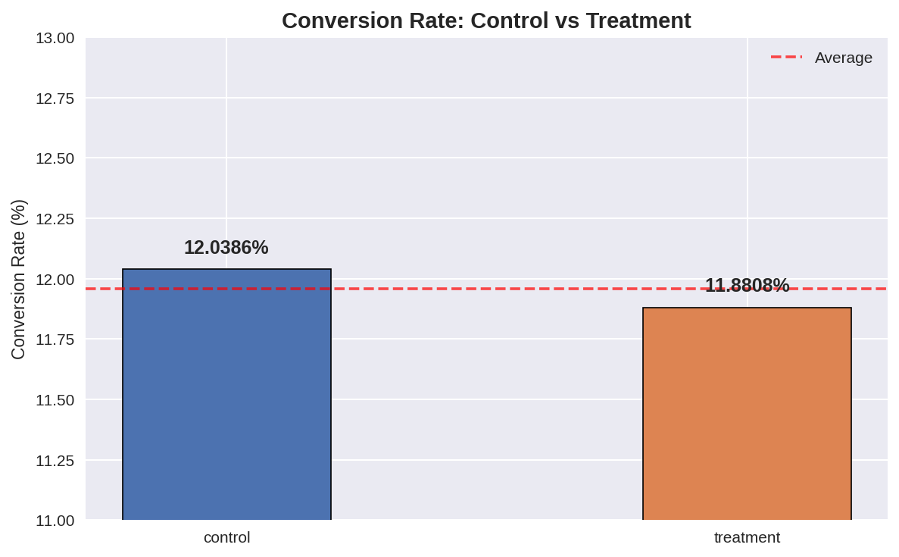
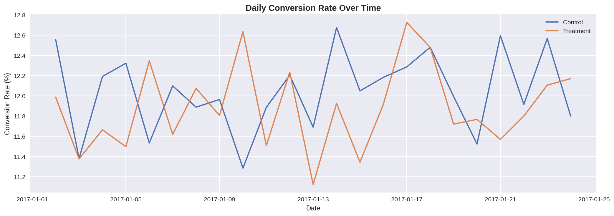
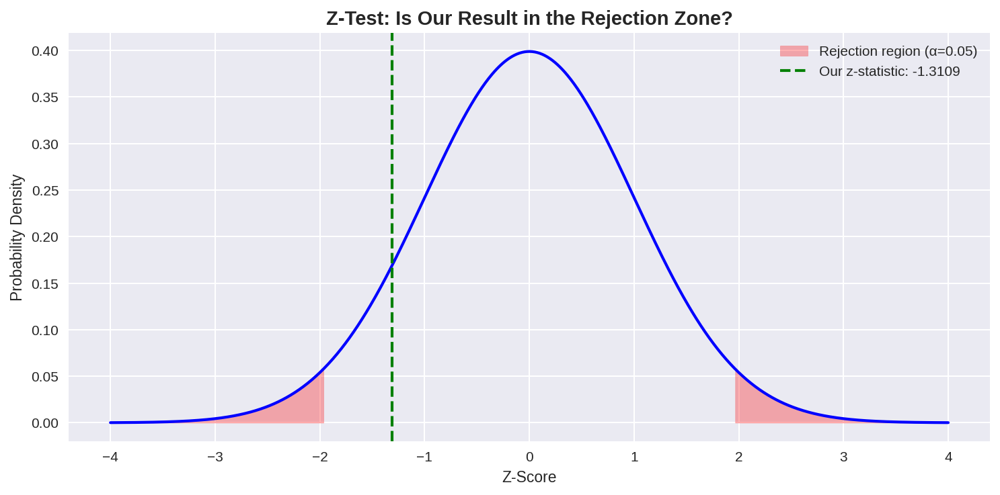

# A/B Test Analysis — E-Commerce Landing Page

## Business Question
Did the new landing page design improve user conversion rates, 
or was the observed difference due to random chance?

## Summary of Findings
- Control conversion rate: 12.04% | Treatment: 11.88%
- P-value: 0.19 — no statistically significant difference found
- Test was adequately powered (~145K users per group)
- **Recommendation: Do not ship the new landing page**

## Project Structure
- Data cleaning — removed mismatched rows and duplicate users
- Exploratory Data Analysis — conversion trends, daily and hourly patterns
- Sanity checks — validated 50/50 split and experiment duration
- Statistical testing — two-proportion z-test with α = 0.05
- Power analysis — confirmed test was adequately powered
- Business impact — estimated revenue effect at scale

## Tools Used
Python, Pandas, NumPy, SciPy, Statsmodels, Matplotlib, Seaborn

## Key Visualizations

## Dataset
[AB Testing Dataset — Kaggle](https://www.kaggle.com/datasets/zhangluyuan/ab-testing)
